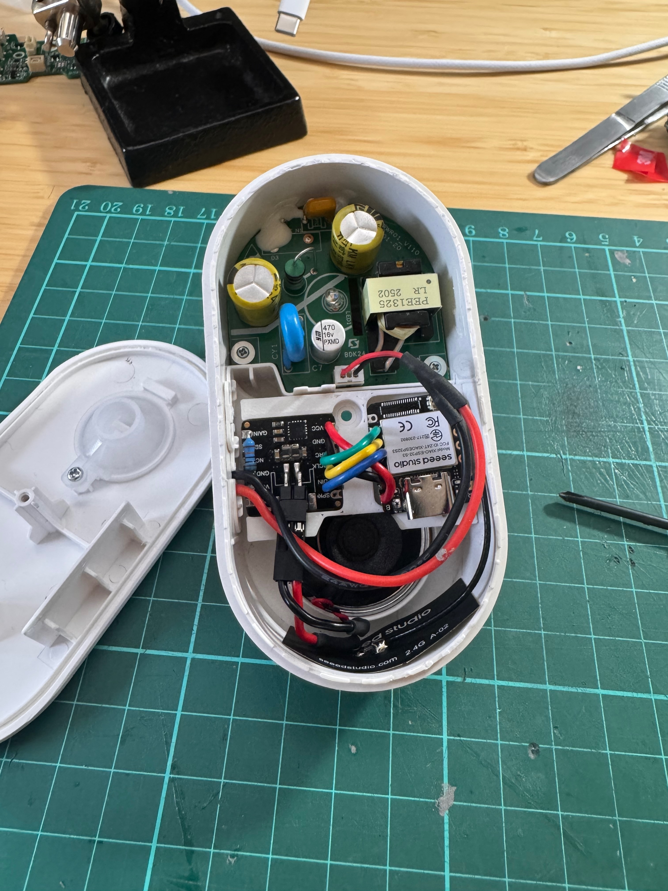

# Reolink Doorbell Chime ESP32 Conversion

I brought a Reolink Doorbell Chime and was disappointed to find I couldn’t use it with Home Assistant - it seems to pair directly with the Reolink Doorbell, and I have a Unifi doorbell.  Instead of throwing it away, I thought I would crack it open and see if I could flash my own firmware to it - but I didn’t recognise the chip.



In for a penny, in for a pound I thought I will use the nice case and power supply, replacing the internals with an ESP32 and DSP.
This is the code for project.

BOM
- 3d printed bracket https://www.printables.com/model/1565198-reolink-doorbell-chime-esp32-conversion 
- Reolink Doorbell Chime https://www.amazon.co.uk/dp/B0CYGZLMS5
- Seeed XIAO ESP32S3 https://thepihut.com/products/seeed-studio-xiao-esp32s3  
- MAX98357 I2S Amplifier Module https://thepihut.com/products/max98357-i2s-amplifier-module 

# Installing esphome & compiling this project on a Mac
```sh
# We'll use pipx to install esphome, and brew to install pipx
$ brew install pipx libmagic cairo

# Install esphome in its own virtual env
$ pipx install esphome

# Add some dependencies to the virtual env
$ pipx runpip esphome install python-magic pillow==11.3.0 cairosvg

# Install the wind tunnel (first time - your device name will vary)
$ ~/.local/bin/esphome run --device=/dev/tty.usbmodem31301 doorbell.yaml

# Install the wind tunnel (susequent times, via WiFi)
$ ~/.local/bin/esphome run doorbell.yaml
```